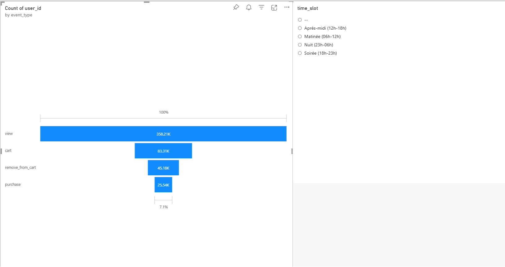
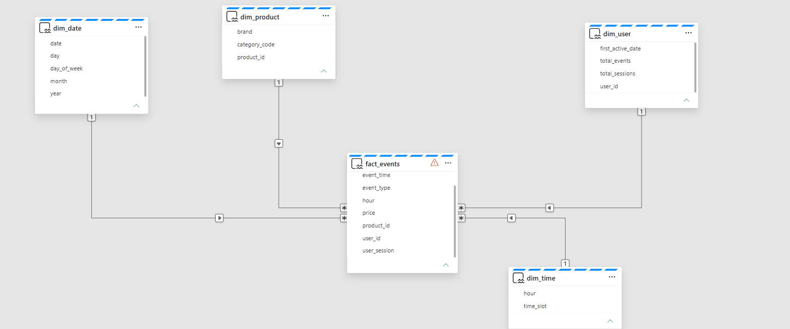
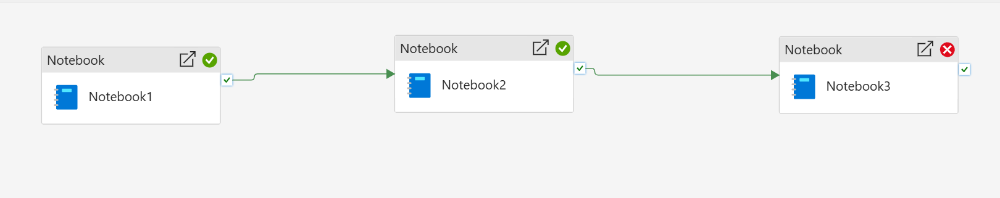
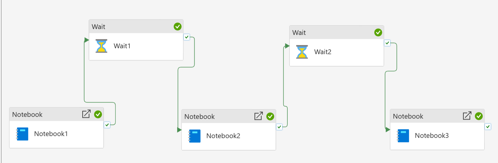

# ShopFlow Powered by Microsoft Fabric

Plateforme de données de bout en bout construite sur **Microsoft Fabric**, exploitant une architecture Medallion pour ingérer, transformer et modéliser plus de 15 millions d'événements de navigation sur un site e-commerce(vue, clique, ajout,retrait...)

---

## 📌 1. Vue Métier & Contexte Analytique

L'objectif de ce projet est de mesurer la performance du tunnel d'achat d'un site e-commerce à fort trafic et d'identifier les déperditions entre la navigation produit et l'achat final.

### Métriques Clés Analysées :
* **Volume global :** 15M+ interactions clients (logs multi-mois de sessions web).
* **Entonnoir de conversion :**
  * **Vues produit :** 1 728 000 (100 %)
  * **Ajouts panier :** 401 000 (23,2 %)
  * **Achats validés :** 122 000 (7,1 % de taux de conversion global)
* **Abandon de panier :** 69,6 % de déperdition entre l'ajout au panier et la commande finale.
* **Accès analytique :** Exposition directe sous Power BI via **Direct Lake**, supprimant les latences de rafraîchissement d'import.

### Tableau de Bord Power BI (Direct Lake) :

*(Figure 1 : Analyse visuelle du tunnel d'achat de la vue jusqu'à la conversion)*

---

## 🏗️ 2. Architecture Technique (Medallion)

Le traitement suit l'architecture Medallion pour séparer la collecte brute, la fiabilisation de la donnée et sa mise à disposition métier :

```
[ Données Sources ]        ──►  Fichiers CSV multi-mois (Oct 2019 à Fév 2020)
       │
       ▼
[ Couche BRONZE ]          ──►  Ingestion brute sans perte (Delta Lake)
                                Ajout de métadonnées (_ingested_at, _source_file)
       │
       ▼
[ Couche SILVER ]          ──►  Nettoyage distribué PySpark
                                Déduplication, validation des types et timestamps
       │
       ▼
[ Couche GOLD ]            ──►  Modélisation dimensionnelle (Schéma en étoile)
                                4 tables de dimensions + 1 table de faits
       │
       ▼
[ Restitution Power BI ]   ──►  Connexion Direct Lake sur OneLake
                                Dashboard interactif de l'entonnoir d'achat
```

---

## 📊 3. Modélisation Dimensionnelle (Star Schema)

La couche Gold est conçue pour optimiser les performances des requêtes analytiques selon les principes de Kimball :

```
             ┌────────────────────────┐
             │        dim_date        │
             │ (date, year, month...) │
             └───────────┬────────────┘
                         │
┌──────────────────┐     │     ┌──────────────────┐
│     dim_user     ├─────┼─────┤   dim_product    │
│  (user_id...)    │     │     │  (product, brand)│
└──────────────────┘     │     └──────────────────┘
                         │
               ┌─────────┴─────────┐
               │    fact_events    │
               │ (event_id, price, │
               │  user_id, date...)│
               └─────────┬─────────┘
                         │
             ┌───────────┴────────────┐
             │     dim_event_type     │
             │ (view, cart, purchase) │
             └────────────────────────┘
```

* **`fact_events`** : Événements atomiques horodatés avec clés étrangères vers chaque dimension.
* **`dim_date`** : Calendrier de granularité journalière pour les analyses temporelles.
* **`dim_product`** : Référentiel des articles, marques et catégories.
* **`dim_user`** : Identifiants anonymisés des visiteurs.
* **`dim_event_type`** : Typologie des interactions (`view`, `cart`, `remove_from_cart`, `purchase`).

### Modèle de Données Gold :

*(Figure 2 : Schéma en étoile dans le SQL Analytics Endpoint)*

---

## ⚙️ 4. Scalabilité & Orchestration

* **Scalabilité PySpark :** Ingestion paramétrable par motif wildcard (`spark.read.csv("Files/raw/*.csv")`), permettant d'absorber l'ensemble des mois sans réécrire le code.
* **Traçabilité :** Injection dynamique du nom du fichier d'origine via `input_file_name()`.
* **Orchestration :** Pipeline Fabric (`pl_shopflow_e2e`) enchaînant les étapes en dépendance conditionnelle (**Upon Success**).

### Orchestration du Data Pipeline :

*(Figure 3 : Chaîne d'orchestration séquentielle Bronze -> Silver -> Gold NB: l'image choisie est celle d'une pipeline qui n'a pas aboutie due au manque de Capacity)*

---
## 🛠️ 5. Résilience Opérationnelle & Monitoring Cloud (Post-Mortem & Amélioration Continue)

En conditions réelles d'ingénierie, la gestion des quotas de calcul et des fenêtres de ressources Cloud fait partie intégrante du rôle de Data Engineer.

### Analyse de l'Incident de Capacité (HTTP 430 Livy Throttling) :
Lors de l'orchestration séquentielle immédiate sur une capacité Fabric d'essai, l'enchaînement sans temps mort de sessions Spark distinctes a provoqué une saturation temporaire du pool (dépassement des Capacity Units / CUs) sur Notebook3.


*(Figure 4 : Détection du seuil de capacité Spark Livy lors de l'enchaînement immédiat des jobs)*

### Mesures Correctives Implémentées :
1. **Introduction d'activités de temporisation (Wait 60s) :** Permettant la destruction propre des sessions Livy et le retour à zéro des CUs entre chaque couche Medallion.
2. **Écrasement explicite de schéma (overwriteSchema=true) :** Neutralisation des conflits de types Delta lors de l'ingestion de nouveaux lots de données mensuelles.
3. **Activation du High Concurrency Mode :** Mutualisation d'une session Spark unique pour l'ensemble des activités du pipeline.


